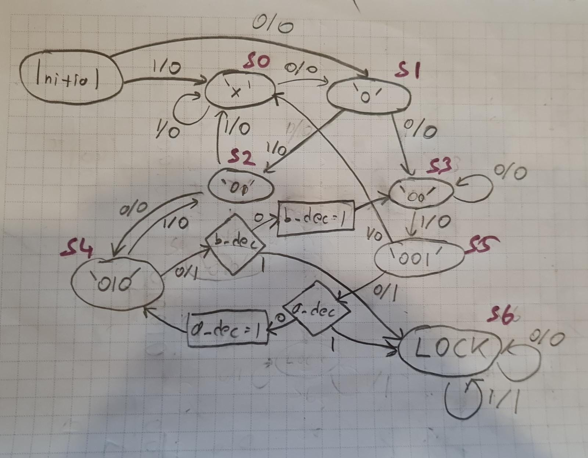
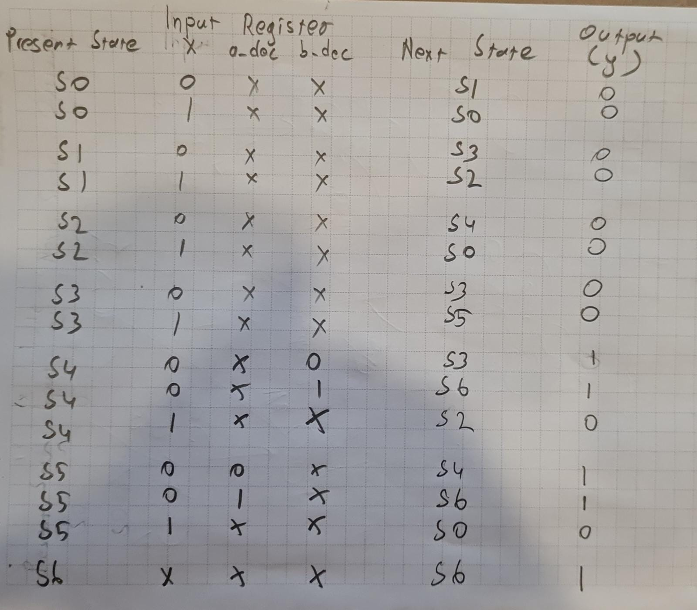
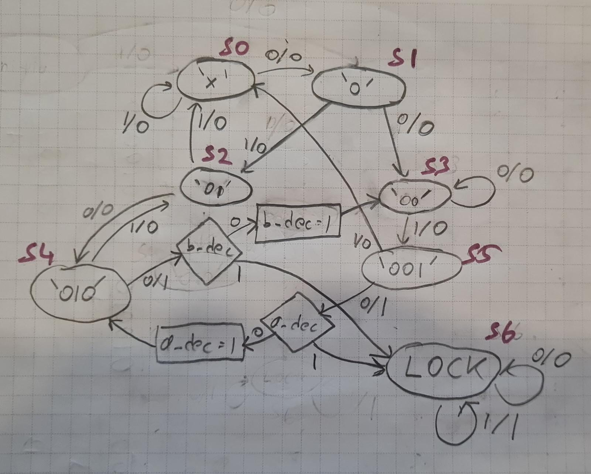
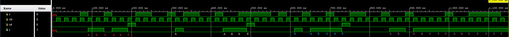

# 4-bit Sequence Tracker
## Sequential Circuit Examle Project
This project implement a synchronous sequential circuit which detects two different 4-bit sequences, A and B. 
A is chosen as 2 in binary, which is 0010, and B is chosen as 4 in binary, which is 0100.

__A and B may overlap.__  

The circuit tracks both sequences simultaneously, and if any of the sequences is detected, it sets output Y to 1. If the same sequence occurs again, the circuit enters a lock state that prevents the output changing from 1. This lock state can only be released by a reset signal. 

### Design Steps
1. [State Diagram](https://github.com/RawAnger/4-bit-Sequence-Tracker/edit/master/README.md#state-diagram)
2. [State Table](https://github.com/RawAnger/4-bit-Sequence-Tracker/edit/master/README.md#state-table)
3. [State Reduction](https://github.com/RawAnger/4-bit-Sequence-Tracker/edit/master/README.md#reduced-state-diagram)
4. [Implementation](https://github.com/RawAnger/4-bit-Sequence-Tracker/edit/master/README.md#implementation)
5. [Simulation](https://github.com/RawAnger/4-bit-Sequence-Tracker/edit/master/README.md#simulation)

### State Diagram

### State Table

### Reduced State Diagram

### Implementation

### Simulation

