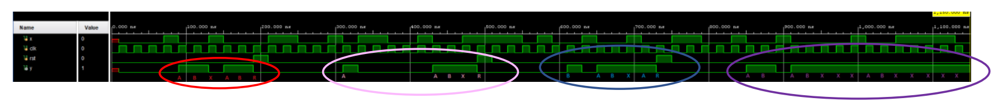

# 4-bit Sequence Tracker
## Sequential Circuit Examle Project
This project implement a synchronous sequential circuit which detects two different 4-bit sequences, A and B. 
A is chosen as 2 in binary, which is 0010, and B is chosen as 4 in binary, which is 0100.

__A and B may overlap.__  

The circuit tracks both sequences simultaneously, and if any of the sequences is detected, it sets output Y to 1. If the same sequence occurs again, the circuit enters a lock state that prevents the output changing from 1. This lock state can only be released by a reset signal. 

### Design Steps
1. [State Diagram](https://github.com/RawAnger/4-bit-Sequence-Tracker/edit/master/README.md#state-diagram)
2. [State Table](https://github.com/RawAnger/4-bit-Sequence-Tracker/edit/master/README.md#state-table)
3. [State Reduction](https://github.com/RawAnger/4-bit-Sequence-Tracker/edit/master/README.md#reduced-state-diagram)
4. [Implementation](https://github.com/RawAnger/4-bit-Sequence-Tracker/edit/master/README.md#implementation)
5. [Simulation](https://github.com/RawAnger/4-bit-Sequence-Tracker/edit/master/README.md#simulation)


### State Diagram
A state diagram is a visual tool used to model the possible states of a system and the events that cause it to transition from one state to another. It is represented by boxes or circles for states and arrows for transitions between states. State diagrams can help identify potential problems in a system, design and test systems. We also should mention that this design is a __Mealy type machine__.


### State Table
A state table is a tabular representation of a state diagram. It shows the states of the system, the inputs or events that cause state transitions, and the resulting outputs or actions that occur during those transitions.

In a state table, each row represents a unique combination of inputs and current state, and each column represents a potential output or resulting action. The table can be used to systematically analyze the behavior of a system, including identifying potential problems or inefficiencies.


### Reduced State Diagram
There are several ways for state reduction. One of them is merging the states. State merging technique 
is basically merging two or more states that perform the same or similar functions into a single state. If 
two states had identical input/output behavior and identical transitions between states they can be 
merged. In this project initial state and “S0” state can be merged because they fulfill these conditions.


### Implementation
Implementation is a crucial step in the Vivado design flow that involves translating a high-level design into a low-level, physical implementation. It includes tasks such as synthesizing the design, placing and routing the components, and generating a bitstream file for the FPGA.

The importance of implementation in a Vivado project lies in the fact that it ensures the functionality and performance of the design, and verifies that it meets the design specifications. Implementation also helps to optimize the design for performance, area utilization, and power consumption, which can have a significant impact on the overall system performance and cost.

Additionally, implementation is critical for ensuring that the design can be successfully programmed onto the target FPGA device. Without proper implementation, the design may not function correctly or may not even be programmable onto the device.

In this project I focus on the maximum delay and try to obtain a faster circuit for a better performance. The initial circuit had a maximum delay of 6.33ns. For first try, I added following timing constraint and obtain a maximum delay of 5.811ns.

```c
set_max_delay -from [get_ports {clk rst x}] -to [get_ports y] 5.000
set_max_delay -from [get_pins {y_reg/D y_reg/G}] -to [get_ports y] 5.000
```

Furthermore, with different implementation strategies an even better result was obtained as 5.609ns. 
We should also check resource and area usage for implementation optimization. However, in this project I only focused on maximum delay.

### Simulation

I deeply investigated the Behavioral Simulation. 
As previously said since the model is __Mealy type__ we observe the output right at the last digit of the sequence came. 

  In the first red part of the simulation, we can observe B overlapping A then A overlapping B and the design successfully catches those conditions. In the red part there is also A overlapping A but as previously declared A can not overlap A without one B sequence happening between them. There is also a second B sequence that follows the second A but since the design is already at the lock stage it does not important. 
  
  In the second part of the input which is circled with pink, one A sequence follows another A 
sequence without any overlapping and the design directly went in to lock stage. 

  In the blue part, we can observe A overlapping B and B overlapping both A and B. When the second B signal arrives, the circuit went in to lock stage again. 
  
  Finally, in the last part which is circled purple, we can observe that after the second A sequence arrives design went into the lock stage and stay there for every input combination. 
In Figure 10, the points A and B sequences happens marked as A or B. Also mark X represent the points which neither A nor B sequence happens. And mark R represent the Reset signals.



